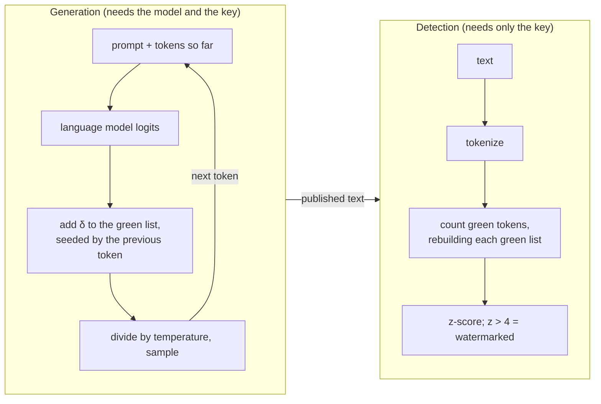
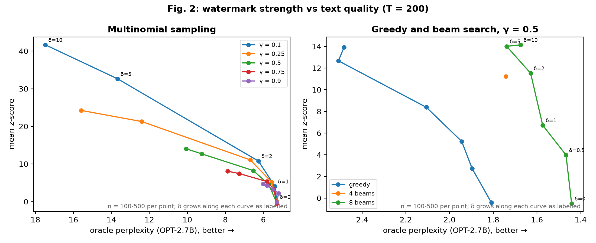
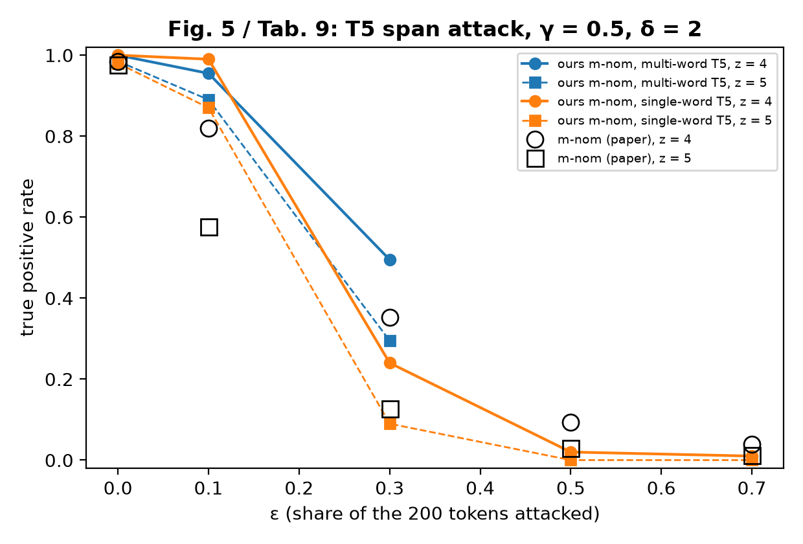
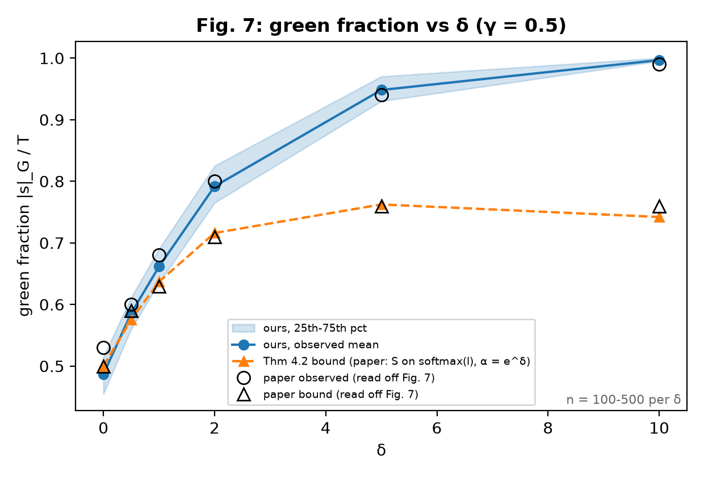
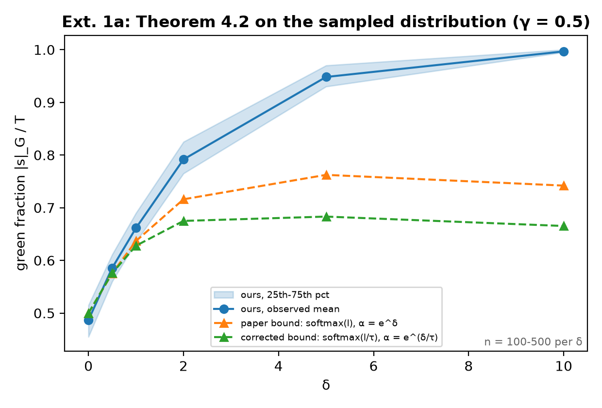
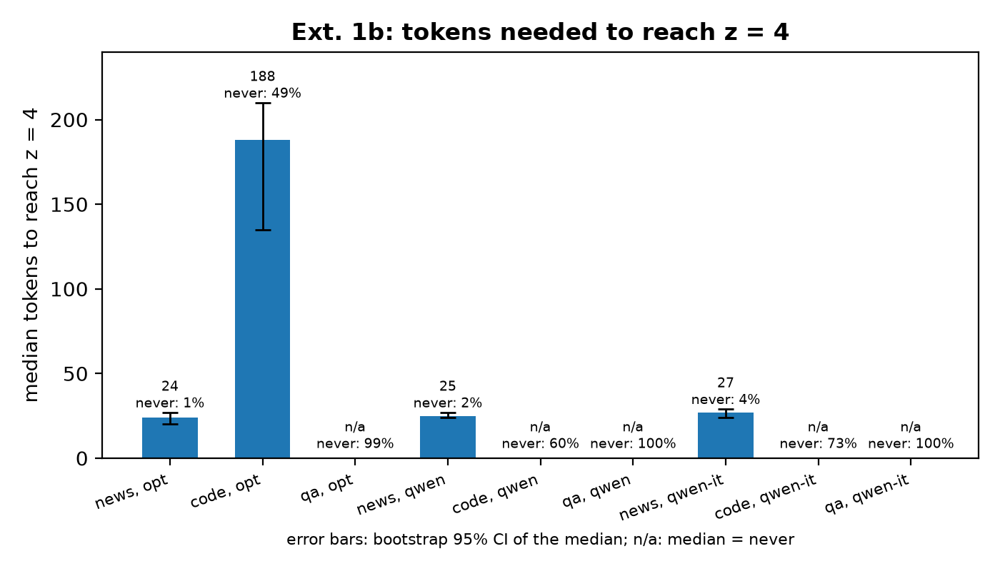
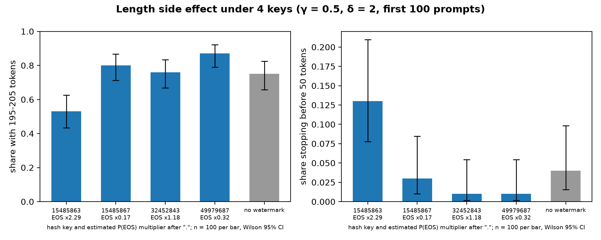
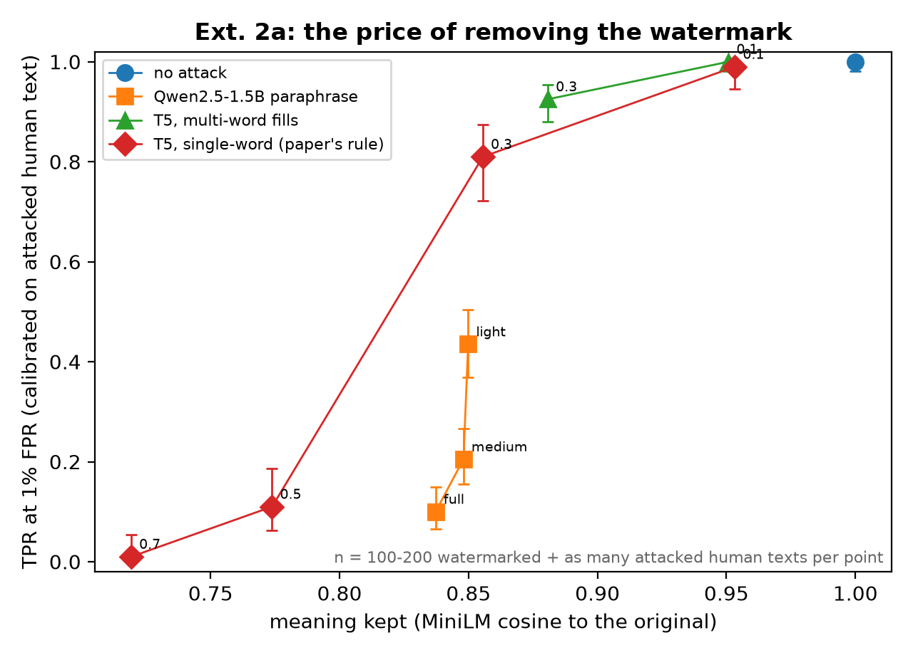
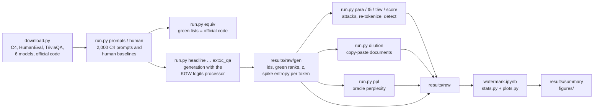

<div align="center">

# Watermarking LLMs

### A reproduction of *A Watermark for Large Language Models* (Kirchenbauer et al., ICML 2023), and two extensions

**Piero Pelosi**

MFE 230ZB – Generative AI and Causality · UC Berkeley MFE · Fall 2026

[Results report](RESULTS.md) · [Notebook](watermark.ipynb) · [Paper](https://arxiv.org/abs/2301.10226) · [Official code](https://github.com/jwkirchenbauer/lm-watermarking)

</div>

---

## TL;DR

1. **The reproduction matches the paper.** Our green lists are bit-identical to the official code (1,000 of 1,000 contexts for OPT, 200 of 200 for Qwen). Headline setting (OPT-1.3B, γ = 0.5, δ = 2): TPR at z = 4 is 0.986 [0.971, 0.993] against the paper's 0.984, with no false positive on 1,000 human texts. Table 8: 11 of 12 rows agree with the paper within 95% intervals.
2. **The T5 attack matches once the paper's one-word rule is followed.** The single-word T5 attack reproduces Table 9 within 95% CIs from ε = 0.3 at z = 5. At z = 4 our attack is slightly stronger (ε = 0.5: 0.020 vs 0.094), and at ε = 0.1 our watermark is more robust (0.990 vs 0.819).
3. **Entropy decides.** On news a watermarked text reaches z = 4 after a median of 24 tokens. On code it takes 188 tokens, and 49% of functions never get there in 200 tokens; short factual answers are essentially never detectable. Instruction tuning lowers the model's entropy, but news detection is unchanged (TPR at 1% FPR 0.990 vs 0.995); the cost shows up in quality instead. Theorem 4.2 stays a valid bound when computed on the distribution actually sampled, and is looser there.
4. **The watermark can change how long texts are, depending on the key.** Under our key the end-of-text token is green after a period while the usual next token (newline) is red, so 16% of watermarked generations stop before 50 tokens, against 6% without the watermark. Three other keys show no such effect.
5. **A 2026 attacker.** One call to a free 1.5B chat model (Qwen2.5-1.5B-Instruct) removes about as much watermark per unit of meaning lost as the paper's T5 attack, which needs 60–140 sequential T5 calls. At a calibrated 1% false-positive rate the paraphraser is clearly stronger (0.435 vs 0.81 still detected at similarity ≈ 0.85).
6. **Copy-paste.** A 60-token watermarked span hidden in a 600-token human document is caught 11.5% of the time by the whole-text test and 86.5% of the time by a sliding-window test (WinMax), both at 1% FPR.

Square brackets are 95% intervals: Wilson for proportions, bootstrap for medians. All details are in [RESULTS.md](RESULTS.md).

---

## Context

Kirchenbauer et al. (2023) propose a watermark that a language model can embed in its text at generation time without any change to the model. Before each token, the previous token seeds a pseudo-random split of the vocabulary into a "green" and a "red" list, and the green logits get a small bonus δ. Human text uses green tokens about a fraction γ of the time; watermarked text uses them more often. Anyone holding the key can therefore count green tokens and run a one-sided z-test, without access to the model. The paper shows near-perfect detection after about 200 tokens on OPT-1.3B, a quality cost that depends on δ and γ, a theorem linking detectability to the model's entropy, and robustness to a T5 word-replacement attack.

The idea is now in production. Since August 2026 Anthropic watermarks Claude's text with a variant of SynthID-Text, a scheme from the same family ([announcement](https://www.anthropic.com/news/claude-text-watermark)). This project reproduces the original paper on its own setup and tests two questions a deployed watermark faces: where it is weak (low-entropy text: code, short answers, chat-tuned models) and what a 2026 attacker can do (paraphrase with a small open model, paste a watermarked span into human text).

---

## Method

**Green list.** For vocabulary size $|V|$ and previous token $s^{(t-1)}$, a generator seeded with $15485863 \cdot s^{(t-1)}$ permutes the vocabulary; the first $\gamma |V|$ entries are green ($G_t$).

**Soft watermark.** With logits $l_k$ and bias $\delta$, the next token is sampled from

$$\hat p_k = \frac{\exp\big(l_k + \delta\,\mathbb 1[k \in G_t]\big)}{\sum_i \exp\big(l_i + \delta\,\mathbb 1[i \in G_t]\big)}.$$

**Detection.** For a text of $T$ tokens with $|s|_G$ green tokens,

$$z = \frac{|s|_G - \gamma T}{\sqrt{T\gamma(1-\gamma)}},$$

and the text is flagged when $z > 4$ (one-sided $p \approx 3 \times 10^{-5}$).

**Spike entropy and Theorem 4.2.** With $\alpha = e^{\delta}$, the spike entropy of a distribution $p$ is $S(p, z) = \sum_k \frac{p_k}{1 + z\,p_k}$ with modulus $z^\ast = \frac{(1-\gamma)(\alpha-1)}{1+(\alpha-1)\gamma}$. If the average spike entropy along a text is at least $S^\ast$, the expected number of green tokens satisfies

$$\mathbb E\,|s|_G \;\ge\; \frac{\gamma \alpha T}{1 + (\alpha - 1)\gamma}\, S^\ast .$$

The paper evaluates $S$ on the raw distribution $\mathrm{softmax}(l)$. Its code, like ours, adds δ before dividing by the sampling temperature τ = 0.7, so the distribution actually sampled is the watermark with bias δ/τ applied to $\mathrm{softmax}(l/\tau)$. Extension 1a recomputes the bound on that distribution.



---

## Results

### Reproduction

**§4.1 headline** (γ = 0.5, δ = 2, multinomial sampling, T = 200 ± 5, 497 texts):

| quantity | paper | ours |
|---|---|---|
| average spike entropy | 0.807 | 0.813 |
| Theorem 4.2 lower bound on the green count | 142.2 | 143.2 |
| observed mean green count | 159.5 | 158.3 [157.5, 159.2] |
| TPR at z = 4 | 0.984 | 0.986 [0.971, 0.993] |
| TPR at z = 4, 4-beam search | 0.996 | 1.000 [0.975, 1.000] |
| FPR at z = 4 on 1,000 human texts | 0 | 0 [0, 0.004] |

**Table 8** (error rates at z = 4; FPR is 0 [0, 0.004] in every row). "Verdict" compares the paper's value with our 95% interval: *consistent* if it lies inside, *different* if the two intervals (the paper's from its own sample size) do not overlap, *borderline* otherwise.

| sampling | δ | γ | n | TPR z = 4, ours | paper | TPR z = 5, ours | paper | verdict (z = 4 / z = 5) |
|---|---|---|---|---|---|---|---|---|
| multinomial | 1 | 0.50 | 300 | 0.700 [0.646, 0.749] | 0.767 | 0.367 [0.314, 0.423] | 0.504 | borderline / different |
| multinomial | 1 | 0.25 | 300 | 0.777 [0.726, 0.820] | 0.729 | 0.537 [0.480, 0.592] | 0.482 | consistent |
| multinomial | 2 | 0.50 | 497 | 0.986 [0.971, 0.993] | 0.984 | 0.980 [0.963, 0.989] | 0.978 | consistent |
| multinomial | 2 | 0.25 | 300 | 1.000 [0.987, 1.000] | 0.994 | 1.000 [0.987, 1.000] | 0.988 | consistent |
| multinomial | 5 | 0.50 | 300 | 1.000 [0.987, 1.000] | 0.996 | 1.000 [0.987, 1.000] | 0.992 | consistent |
| multinomial | 5 | 0.25 | 300 | 1.000 [0.987, 1.000] | 1.000 | 1.000 [0.987, 1.000] | 0.998 | consistent |
| 8-beam | 1 | 0.50 | 100 | 0.850 [0.767, 0.907] | 0.873 | 0.750 [0.657, 0.825] | 0.812 | consistent |
| 8-beam | 1 | 0.25 | 100 | 0.820 [0.733, 0.883] | 0.819 | 0.750 [0.657, 0.825] | 0.770 | consistent |
| 8-beam | 2 | 0.50 | 150 | 0.993 [0.963, 0.999] | 0.992 | 0.987 [0.953, 0.996] | 0.984 | consistent |
| 8-beam | 2 | 0.25 | 150 | 0.993 [0.963, 0.999] | 0.994 | 0.987 [0.953, 0.996] | 0.990 | consistent |
| 8-beam | 5 | 0.50 | 100 | 1.000 [0.963, 1.000] | 1.000 | 1.000 [0.963, 1.000] | 1.000 | consistent |
| 8-beam | 5 | 0.25 | 100 | 1.000 [0.963, 1.000] | 1.000 | 1.000 [0.963, 1.000] | 1.000 | consistent |

<p align="center"></p>
<p align="center"><em>Fig. 2. Left: a smaller green list gives a higher z at the same perplexity; γ = 0.1 is Pareto-best, as in the paper. Right: 8-beam search reaches z = 11.5 at δ = 2 with perplexity 1.63, against 1.44 without the watermark.</em></p>

**Table 9, T5 span attack** (γ = 0.5, δ = 2; each replacement is exactly one word, as the paper describes; 100 texts; AUC against the unattacked human texts):

| ε | TPR z = 4, ours | paper | TPR z = 5, ours | paper | AUC, ours (paper) | perplexity, ours (paper) |
|---|---|---|---|---|---|---|
| 0.1 | 0.990 [0.946, 0.998] | 0.819 | 0.870 [0.790, 0.922] | 0.577 | 1.000 (0.988) | 9.2 (13.1) |
| 0.3 | 0.240 [0.167, 0.332] | 0.353 | 0.090 [0.048, 0.162] | 0.127 | 0.996 (0.954) | 16.0 (21.2) |
| 0.5 | 0.020 [0.006, 0.070] | 0.094 | 0.000 [0, 0.037] | 0.029 | 0.868 (0.838) | 24.8 (28.4) |
| 0.7 | 0.010 [0.002, 0.054] | 0.039 | 0.000 [0, 0.037] | 0.012 | 0.652 (0.696) | 33.5 (33.9) |

The attack code was not released, so ours follows the paper's description. Letting T5 fill multi-word spans instead makes the attack much weaker (TPR at z = 4 0.495 at ε = 0.3, 200 texts): the texts grow from 200 to 295 tokens, and z grows with √T at a fixed green fraction.

<p align="center"></p>
<p align="center"><em>Fig. 5. Detection after the T5 attack: our single-word and multi-word variants, the paper's values as black hollow markers.</em></p>

<p align="center"></p>
<p align="center"><em>Fig. 7. Observed green fraction (0.661 / 0.792 / 0.948 at δ = 1 / 2 / 5; paper ≈ 0.68 / 0.80 / 0.94) and the Theorem 4.2 bound (0.637 / 0.716 / 0.762; paper ≈ 0.63 / 0.71 / 0.76): tight for small δ, conservative for large δ.</em></p>

### Extension 1: entropy decides

**1a. The bound on the distribution actually sampled.** Recomputed on $\mathrm{softmax}(l/\tau)$ with $\alpha = e^{\delta/\tau}$, Theorem 4.2 is still a valid lower bound in all 22 multinomial runs, but it is looser for δ ≥ 2 (γ = 0.5, δ = 2: 0.675 against 0.716 for the paper's version; observed 0.792). Temperature lowers the spike entropy (0.714 vs 0.813) more than the larger effective bias raises the coefficient. The paper's large-δ gap is therefore the bound's own conservatism, not a temperature effect.

<p align="center"></p>

**1b. News vs code vs short answers** (OPT-1.3B; γ = 0.25, δ = 2 for news and code; TriviaQA greedy, γ = 0.5, δ = 2; 1% FPR thresholds from each domain's own unwatermarked texts):

| domain | spike entropy (sampled) | TPR at 1% FPR | median tokens to z = 4 | never reach z = 4 |
|---|---|---|---|---|
| news (C4) | 0.53 | 0.990 [0.964, 0.997] | 24 [20, 27] | 1% |
| code (HumanEval) | 0.35 | 0.524 [0.448, 0.599] | 188 [135, never] | 49% [42, 57] |
| short answers (TriviaQA, up to 16 tokens) | – | – | never | 99% |

At γ = 0.5 a 16-token answer cannot exceed z = 4 at all, whatever its entropy (the QA row uses greedy decoding, so its entropy and 1%-FPR numbers are not comparable; see RESULTS.md). Code also breaks the z-test's independence assumption: the same (previous token, token) pairs, such as newline followed by indentation, repeat dozens of times. Unwatermarked code therefore has mean z −2.88 instead of about 0, and ignoring repeated pairs restores −0.45.

<p align="center"></p>

**1c. Base vs instruction-tuned model** (Qwen2.5-1.5B vs Qwen2.5-1.5B-Instruct, same architecture and tokenizer; news, γ = 0.25, δ = 2):

| | base | instruct |
|---|---|---|
| entropy of the unwatermarked model (nats) | 2.52 | 1.96 |
| TPR at 1% FPR | 0.995 [0.972, 0.999] | 0.990 [0.964, 0.997] |
| median tokens to z = 4 | 25 [24, 27] | 27 [24, 29] |

Instruction tuning lowers entropy in every domain, yet news detection is indistinguishable. Under the watermark the instruct model's entropy rises from 1.96 to 2.31 nats: the bias pushes it off its confident path. The price is quality: perplexity under the base model rises from 5.67 to 9.55 (25.6 at δ = 4). On code there is no consistent base-vs-instruct difference. On TriviaQA the watermark costs no accuracy (exact match 0.202 → 0.212) and is invisible (answers average 5.8 tokens).

### Length side effect

Under our key, γ = 0.5, δ = 2, 50% of generations reach 195 tokens against 70% without the watermark, and 16% [14, 18] stop before 50 tokens against 6% [4, 7]. The reason: most natural endings come right after a period, and under this key the end-of-text token is green there while newline, the most common continuation, is red. δ = 2 then multiplies the probability of stopping by about 2.3. Under three other keys the multiplier is 0.17, 1.18 and 0.32, and the length distribution is indistinguishable from no watermark. The paper's T = 200 ± 5 filter hides this effect from its detection tables.

<p align="center"></p>

### Extension 2: a 2026 attacker

**2a. Paraphrase vs T5.** The same watermarked texts are attacked by T5 (the paper's attack) and by Qwen2.5-1.5B-Instruct asked to edit lightly, paraphrase, or rewrite. False positives are calibrated on human texts attacked the same way; meaning kept is the cosine similarity of MiniLM sentence embeddings.

| attack | meaning kept | TPR at z = 4 | TPR at 1% FPR | AUC |
|---|---|---|---|---|
| T5 single-word, ε = 0.3 | 0.856 [0.843, 0.868] | 0.240 [0.167, 0.332] | 0.810 [0.722, 0.875] | 0.995 |
| T5 single-word, ε = 0.5 | 0.774 [0.757, 0.791] | 0.020 [0.006, 0.070] | 0.110 [0.063, 0.186] | 0.824 |
| Qwen, light edit | 0.850 [0.828, 0.872] | 0.220 [0.168, 0.282] | 0.435 [0.368, 0.504] | 0.881 |
| Qwen, paraphrase | 0.848 [0.834, 0.862] | 0.035 [0.017, 0.070] | 0.205 [0.155, 0.266] | 0.773 |
| Qwen, full rewrite | 0.837 [0.822, 0.852] | 0.015 [0.005, 0.043] | 0.100 [0.066, 0.149] | 0.705 |

At the fixed threshold z = 4, light paraphrase and single-word T5 at matched meaning are indistinguishable (0.22 vs 0.24). At a calibrated 1% FPR the paraphraser is clearly stronger (0.435 vs 0.81). To bring detection down to about 0.1, T5 needs ε = 0.5 and keeps 0.774 of the meaning, while a full rewrite keeps 0.837. Removing the watermark still costs meaning (about 15% of similarity), but it now takes one prompt to a free model.

<p align="center"></p>

**2b. Copy-paste dilution.** One watermarked span inside a 600-token human document; thresholds for 1% FPR come from 1,000 human-only documents.

| watermarked share | whole-text z | WinMax (sliding window) |
|---|---|---|
| 10% (60 tokens) | 0.115 [0.078, 0.167] | 0.865 [0.811, 0.906] |
| 25% (150 tokens) | 0.815 [0.755, 0.863] | 0.995 [0.972, 0.999] |
| 50% (300 tokens) | 1.000 [0.981, 1.000] | 1.000 [0.981, 1.000] |

The window test from the authors' follow-up paper answers the open question in the original paper's conclusion for spans of about 60 tokens or more.

### Limitations

- **One weaker Table 8 row.** Multinomial δ = 1, γ = 0.5 detects less than in the paper (z = 5: 0.367 vs 0.504; the intervals do not overlap). This is plausibly key-specific (last point below) but untested.
- **T5 at the extremes.** At ε = 0.1 our watermark survives the attack better than in the paper (0.990 vs 0.819), and at ε = 0.5 (z = 4) our attack removes slightly more (0.020 vs 0.094).
- **Noisy 1%-FPR thresholds in 2a.** Each threshold is the 99th percentile of 100–200 attacked human texts. The AUC column, which uses every negative, supports the main comparison (0.881 for the light paraphrase against 0.995 for T5 at ε = 0.3).
- **Key-specific null calibration.** For our key, unwatermarked text has mean z −0.20 (human) and −0.37 (model text) at γ = 0.5. Across six keys the mean ranges from −0.52 to +0.71, and repeated token pairs push the standard deviation to 1.03–1.36. The false-positive rate at z = 4 on human text is still 0, but deployed thresholds should be calibrated empirically, as every 1%-FPR number here is.

---

## How the pipeline works



Every generated row stores the green rank of each token rather than a 0/1 flag. The same generations can then be rescored for any γ, ignoring repeats, or over any prefix length, without touching the model again. The notebook only reads `results/raw/` and rebuilds every table and figure.

| file | role |
|---|---|
| `params.py` | every knob and every experiment grid (plain dicts and lists) |
| `core.py` | data, models, the watermark logits processor, generation, detection, perplexity, T5 and paraphrase attacks |
| `stats.py` | z-scores, ROC/AUC, TPR at fixed FPR, Theorem 4.2 bounds, Wilson and bootstrap intervals |
| `plots.py` | one function per figure (matplotlib) |
| `run.py` | command line for every step: `python run.py list` |
| `watermark.ipynb` | loads the results, builds every table and figure, shows them next to the paper's |
| `download.py` | data, models and the official code (pinned commit) |

---

## Reproduce

**Setup** (Python 3.12):

```bash
git clone https://github.com/pieropls/230ZB.git && cd 230ZB
python3 -m venv .venv && source .venv/bin/activate
pip install -r requirements.txt
```

**Fast path: rebuild every table and figure from the saved results** (about one minute; no model weights, only the OPT and Qwen tokenizers, a few MB, fetched on first run):

```bash
jupyter nbconvert --to notebook --execute --inplace watermark.ipynb
```

**Download the data and models** (needed for everything below): C4 RealNewsLike shard 0, HumanEval, TriviaQA validation, the official watermark code at a pinned commit, and six models (OPT-1.3B, OPT-2.7B, T5-Large, Qwen2.5-1.5B, Qwen2.5-1.5B-Instruct, all-MiniLM-L6-v2), about 20 GB in total.

```bash
python download.py
export HF_HUB_OFFLINE=1   # optional: everything is on disk now, skip Hub checks
```

**Smoke test** (a few minutes):

```bash
python run.py equiv     # our green lists against the official code: must print PASS
python run.py check     # 16 watermarked generations (most with z > 4) and 16 unwatermarked ones
```

**Full re-run.** `python run.py list` prints the steps in order; every step appends to `results/raw/` and resumes where it stopped, so move the shipped `results/raw/` away first to start from scratch. Approximate times on the machine used (Apple M5 Pro, 24 GB, `mps`):

| step | what it runs | time |
|---|---|---|
| `prompts`, `equiv`, `human`, `check` | prompts, equivalence test, human baselines, smoke test | ~5 min |
| `headline` | §4.1 (multinomial, 4-beam, δ = 0) | 25 min |
| `table8` | Table 8 / Fig. 4 | 1.5 h |
| `fig2_grid` | Fig. 2 left, Fig. 3a/b, Fig. 7 | 35 min |
| `fig2_beams` | Fig. 2 right (greedy, 8-beam) | 2 h |
| `fig3c_beams` | Fig. 3c (8-beam, γ = 0.25) | 3 h |
| `ext1b`, `ext1c`, `ext1c_qa` | Extension 1 | 15 min |
| `keys` | length side effect under 3 other keys | 4 min |
| `para`, `t5`, `t5w`, `score` | Extension 2a and Table 9 | 9 h |
| `dilution` | Extension 2b | 1 min |
| `ppl`, `ppl_qwen` | oracle perplexity | 1 h |

The total is about 20 hours, dominated by the T5 attacks and 8-beam search. Sampling on another device draws different random numbers, so a full re-run reproduces the statistics, not the exact texts.

---

## Repository layout

```
.
├── README.md
├── RESULTS.md            detailed report: every table with 95% intervals, deviations, limitations
├── watermark.ipynb       rebuilds every table and figure from results/raw/
├── params.py             knobs and experiment grids
├── core.py               data, models, watermark, generation, detection, attacks
├── stats.py              z-scores, ROC/AUC, Theorem 4.2, confidence intervals
├── plots.py              one function per figure
├── run.py                command line for every step
├── download.py           data, models, official code
├── requirements.txt      pinned versions
├── LICENSE
├── figures/              18 figures (PNG) and the TriviaQA table
└── results/
    ├── prompts_c4.jsonl.gz   2,000 C4 prompts with their human baselines
    ├── raw/                  every generation, attack and perplexity (gzipped JSON lines)
    └── summary/              every table (CSV and Markdown) and check (JSON, text)
```

---

## Deviations from the paper

All listed with their reasons in [RESULTS.md](RESULTS.md#deviations). The main ones:

- Green lists use a CPU random generator (the paper's runs used CUDA), so the concrete lists differ while the scheme is identical; ours match the official code run on CPU bit for bit.
- As in the paper's script, prompts are drawn until enough generations have 195–205 tokens, but each configuration is filtered on its own length.
- The T5 attack is implemented from the paper's description: T5-Large in bfloat16, ±60-token windows, 50-beam search with 20 candidates. ε levels are nested snapshots of a single replacement process per text.
- Perplexity is computed on token ids (generator and oracle share the tokenizer).
- 8-beam rows beyond δ = 2 use 100 texts instead of about 500. The optional SynthID-Text experiment was not run.

---

## How Claude was used

I specified the paper, the scope, the extensions and the checks. Claude Code wrote the code and ran the experiments under that specification, and I reviewed the results.

---

## References and credits

- J. Kirchenbauer, J. Geiping, Y. Wen, J. Katz, I. Miers, T. Goldstein. *A Watermark for Large Language Models.* ICML 2023. [arXiv:2301.10226](https://arxiv.org/abs/2301.10226). Official code: [jwkirchenbauer/lm-watermarking](https://github.com/jwkirchenbauer/lm-watermarking) (Apache-2.0; downloaded by `download.py`, not included here).
- J. Kirchenbauer et al. *On the Reliability of Watermarks for Large Language Models.* ICLR 2024. [arXiv:2306.04634](https://arxiv.org/abs/2306.04634). Source of WinMax and of the copy-paste setting.
- S. Dathathri et al. *Scalable watermarking for identifying large language model outputs.* Nature 634, 2024 (SynthID-Text).
- N. Jovanović, R. Staab, M. Vechev. *Watermark Stealing in Large Language Models.* ICML 2024. [arXiv:2402.19361](https://arxiv.org/abs/2402.19361).
- Data: C4 RealNewsLike ([allenai/c4](https://huggingface.co/datasets/allenai/c4), ODC-BY), [HumanEval](https://huggingface.co/datasets/openai/openai_humaneval), [TriviaQA](https://huggingface.co/datasets/mandarjoshi/trivia_qa).
- Models: [OPT-1.3B](https://huggingface.co/facebook/opt-1.3b) and [OPT-2.7B](https://huggingface.co/facebook/opt-2.7b), [T5-Large](https://huggingface.co/google-t5/t5-large), [Qwen2.5-1.5B](https://huggingface.co/Qwen/Qwen2.5-1.5B) and [Qwen2.5-1.5B-Instruct](https://huggingface.co/Qwen/Qwen2.5-1.5B-Instruct), [all-MiniLM-L6-v2](https://huggingface.co/sentence-transformers/all-MiniLM-L6-v2). Each dataset and model is used under its own license.

Code in this repository: MIT ([LICENSE](LICENSE)).
